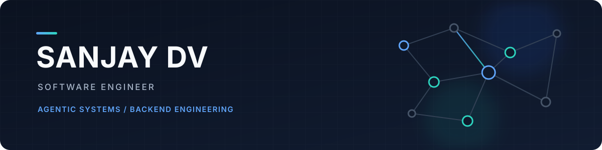

  

  <a href="https://www.linkedin.com/in/sanjay-dv/">LinkedIn</a>
  &nbsp;&nbsp;/&nbsp;&nbsp;
  <a href="mailto:reach.sdv1708@gmail.com">Email</a>
  &nbsp;&nbsp;/&nbsp;&nbsp;
  <a href="https://github.com/sdv1708?tab=repositories">Repositories</a>

## I build systems that have to earn trust.

I am a software engineer working across agentic AI, backend engineering, and
distributed systems. I am especially interested in applications where model
outputs need to be grounded, inspectable, and supported by reliable software
around them.

My work spans multi-agent workflows, retrieval systems, evaluation pipelines,
concurrency-safe APIs, and the lower-level mechanics behind language models and
distributed storage.

## Featured projects

### [PostMortem AI](https://github.com/sdv1708/postmortem)

An evidence-first incident analysis system that turns logs, traces, and deployment
notes into a reviewable postmortem. Its six-stage pipeline uses specialized
generation, criticism, and verification steps; every claim is cited or marked as
an assumption, and the final root-cause decision remains with a human reviewer.

[Repository](https://github.com/sdv1708/postmortem) /
[Live demo](https://postmortem-frontend-euyq.onrender.com/)

`Python` `FastAPI` `Next.js` `TypeScript` `Pydantic` `SQLAlchemy`

### [Executive Intelligence Copilot](https://github.com/sdv1708/intelligence_copilot)

A supervisor-orchestrated RAG system that converts meeting documents into cited
executive briefs and grounded follow-up answers. Parallel research agents,
evidence-preserving retrieval, cross-meeting memory, and execution traces make
the system's conclusions inspectable.

`FastAPI` `LangGraph` `React` `TypeScript` `FAISS` `SQLite`

### [Concurrent Reservation API](https://github.com/sdv1708/concurrent-reservation)

A hotel reservation backend built around transactional correctness. Row-level
locking prevents double bookings, a strict state machine governs reservation and
payment transitions, and signed Stripe webhooks safely finalize asynchronous
payments.

`Python` `FastAPI` `SQLAlchemy` `PostgreSQL` `Stripe` `pytest`

## Currently developing

### [Distributed Key-Value Store](https://github.com/sdv1708/distributed-kv-store)

Designing a key-value store from first principles, beginning with a crash-safe
LSM-tree storage engine using a write-ahead log, memtable, SSTables, Bloom
filters, compaction, and tombstones. The distributed design explores consistent
hashing, replication, tunable quorums, and vector-clock conflict detection.

`Python` `LSM tree` `WAL` `consistent hashing` `quorum consensus`

### [GPT from Scratch](https://github.com/sdv1708/gpt-scratch)

Building a working GPT one primitive at a time. The completed foundations derive
gradient descent, backpropagation, initialization, and normalization explicitly
in NumPy and PyTorch; attention and transformer blocks are now in progress.

`Python` `NumPy` `PyTorch` `transformers` `first-principles ML`

## Experience

**Software Engineer, AI — Virtual Gold** 
*June 2026 – Present*

Deeply involved in learning, implementing, and understanding agentic workflows
and applications, with an emphasis on turning emerging patterns into reliable,
production-minded software.

**Software Engineer Intern, AI — Connyct / CampusAI** 
*September 2025 – December 2025*

Developed and deployed a production LLM recommendation service using RAG,
Elasticsearch vector retrieval, Redis caching, Amazon Bedrock, and AWS ECS.
Introduced evaluation-driven release gates for hallucination, relevance,
groundedness, and latency.

**Software Development Engineer — University of Maryland, Community Preservation Trust** 
*February 2025 – December 2025*

Helped transform email-based and handwritten rental operations into a secure,
multi-tenant React and Flask platform serving more than 15,000 applicants and
administrators.

**Software Development Engineer, AI and Backend — IQVIA** 
*March 2022 – July 2024*

Built AI-assisted document-processing and backend systems in regulated
production environments. The work included Azure-hosted extraction workflows,
Airflow-orchestrated OCR pipelines, event-driven services processing more than
3,000 messages per second, and FastAPI services over high-volume PostgreSQL
payment data.

## Engineering toolkit

| Area | Technologies |
| --- | --- |
| Languages | Python, TypeScript, SQL |
| Applied AI | LLMs, RAG, LangChain, LangGraph, Google ADK, DeepEval, PyTorch, scikit-learn, Hugging Face |
| Backend and data | FastAPI, Flask, React, PostgreSQL, MySQL, Redis, Pinecone, Kafka, Airflow, Elasticsearch |
| Infrastructure | AWS, Azure, Docker, Kubernetes, CI/CD, Linux, Claude Code, Cursor |

## Education

**M.S. in Information Systems** — University of Maryland, Robert H. Smith School
of Business, December 2025

**B.S. in Electronics Engineering** — PES University, May 2022

---

I am open to backend, applied AI, and ML infrastructure opportunities in the
United States. The best way to reach me is through
[LinkedIn](https://www.linkedin.com/in/sanjay-dv/) or
[email](mailto:reach.sdv1708@gmail.com).
